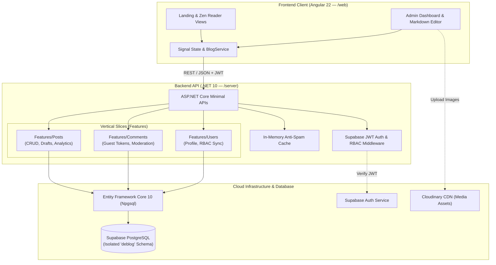

<div align="center">


# 🚀 deblog — Modern Full-Stack Developer Blog

[](https://angular.dev/)
[](https://dotnet.microsoft.com/)
[](https://www.typescriptlang.org/)
[](https://tailwindcss.com/)
[](https://supabase.com/)
[](#-system-architecture)
[](./LICENSE)

<p align="center">
  <b>A high-performance, developer-first personal blogging platform engineered with an Angular 22 signal-driven frontend and an ASP.NET Core 10 Vertical Slice Architecture backend.</b>
</p>

[✨ Live Features](#-key-features) •
[🏛️ Architecture](#-system-architecture) •
[📦 Tech Stack](#-tech-stack) •
[🚀 Getting Started](#-getting-started) •
[🔌 API Reference](#-api-reference) •
[⚙️ Configuration](#-configuration--environment) •
[📄 License](#-license)

</div>

---

## 📍 Road Map 
- [ ] web and server Integration
- [ ] web and Supabase JWT authentication Setup
- [ ] Post management optimizing
- [ ] Web placeholder and mock data clean up
- [ ] web and server data alignment

---

## 📖 Overview

**deblog** is a production-grade, full-stack personal blogging solution tailored for developers and tech writers. Built with modern web standards, it combines a tactile, retro-futuristic developer aesthetic with enterprise-grade engineering practices:

- **Frontend (`/web`)**: Powered by **Angular 22** utilizing standalone components, fine-grained **Signals** for reactive state, **Tailwind CSS v4** styling, Lucide icons, keyboard-driven navigation (F-key bar), and distraction-free **Zen Reader Mode**.
- **Backend (`/server`)**: Powered by **ASP.NET Core 10 Minimal APIs** structured around **Vertical Slice Architecture (VSA)**, **Entity Framework Core 10**, an isolated **PostgreSQL schema** (`deblog`) hosted on **Supabase**, **Supabase Auth JWT** verification, and in-memory anti-spam rate limiting.

---

## ✨ Key Features

### 📖 Guest & Reader Experience
* **⚡ Instant Client-Side Navigation**: Built with Angular Signals and fine-grained reactive primitives with default `OnPush` performance.
* **🧘 Zen Reading Mode**: One-click distraction-free reading overlay optimizing line-lengths, typography, and contrast.
* **⌨️ Retro BIOS F-Key Control Bar**: Quick keyboard shortcuts (F1–F12) for searching, reading mode toggles, help modals, and theme switching.
* **📝 Rich Markdown Content Engine**: Markdown parsing with code syntax highlighting, reading time calculation, and canonical link generation.
* **💬 Guest Commenting System**: Anonymous/guest commenting requiring email verification, issuing unique `ManagementToken` headers (`X-Comment-Token`) for subsequent guest edits or soft-deletions.
* **📊 Deduplicated Analytics**: In-memory IP cooldown cache tracking unique Post Views, Likes, and Shares without database bloat.
* **🎨 Multiple Color Themes & Fonts**: Built-in dark mode, light mode, retro BIOS green, and configurable typography fonts.

### 🛡️ Author & Admin Control Center
* **🔐 Supabase RBAC Authentication**: Secure JWT-based administrative access protecting authoring and moderation endpoints.
* **✍️ Interactive Markdown Editor**: Real-time side-by-side editing with live preview and Draft/Published visibility states.
* **🛡️ Comment Moderation Workflow**: Admin review pipeline with status triage (`Pending`, `Approved`, `Removed`).
* **🖼️ Media Asset Management**: Integrated asset browser with image cropping tool and Cloudinary CDN connectivity.
* **👥 User & Author Management**: Role-based access control (Admin, Author, Guest) and automated startup author seeding.
* **📈 Post Analytics Dashboard**: Real-time tracking of view counts, like ratios, share metrics, and comment engagement.

---

## 🏛️ System Architecture

`deblog` leverages **Vertical Slice Architecture (VSA)** on the backend to keep feature concerns cohesive and strictly isolated, coupled with a reactive Angular frontend.



---

## 📦 Tech Stack

### Frontend (`/web`)
| Layer | Technology | Details |
| :--- | :--- | :--- |
| **Framework** | [Angular 22](https://angular.dev/) | Standalone components, modern Signals reactive primitives |
| **Styling** | [Tailwind CSS v4.1](https://tailwindcss.com/) + PostCSS | Zero-runtime CSS with modern cascade layers |
| **Icons** | [Lucide Angular](https://lucide.dev/) | Lightweight, modern icon set (`@lucide/angular`) |
| **Markdown** | [Marked](https://marked.js.org/) | High-speed Markdown parser and compiler |
| **Testing** | [Vitest](https://vitest.dev/) + JSDOM | Blazing fast next-gen unit testing runner |
| **Package Manager**| [pnpm v11](https://pnpm.io/) | Fast, disk-space efficient package manager |

### Backend (`/server`)
| Layer | Technology | Details |
| :--- | :--- | :--- |
| **Framework** | [ASP.NET Core (.NET 10)](https://dotnet.microsoft.com/) | Minimal APIs with modular `MapGroup` endpoints |
| **Architecture** | Vertical Slice Architecture (VSA) | High cohesion, zero layer bloat, single-responsibility slices |
| **ORM** | [Entity Framework Core 10](https://learn.microsoft.com/ef/core/) | Code-first migrations with isolated database schema |
| **Database** | [PostgreSQL (Supabase)](https://supabase.com/) | Connected via `Npgsql.EntityFrameworkCore.PostgreSQL` |
| **Authentication** | [Supabase Auth](https://supabase.com/auth) | JWT Bearer authentication with `AdminOnly` authorization policies |
| **Media CDN** | [CloudinaryDotNet](https://cloudinary.com/) | Cloud-hosted image storage and transformations |
| **Documentation** | [Swashbuckle Swagger UI](https://github.com/domaindrivendev/Swashbuckle.AspNetCore) | OpenAPI 3.0 spec with interactive JWT Bearer authorization |
| **Testing** | [xUnit](https://xunit.net/) + TestServer | Integration and unit testing with in-memory SQLite/EF providers |

---

## 📂 Repository Structure

```text
deblog/
├── .github/                 # CI/CD workflows and repository automation
├── LICENSE                  # MIT License
├── README.md                # Main monorepo documentation
│
├── server/                  # 🌐 ASP.NET Core 10 Backend API
│   ├── Common/              # Cross-cutting middleware, extensions, services
│   │   ├── Extensions/      # Swagger, Database, Supabase Auth configuration
│   │   ├── Middleware/      # Global exception handling & ProblemDetails
│   │   └── Services/        # Memory cache & visitor analytics tracker
│   ├── Features/            # 🍰 Vertical Feature Slices
│   │   ├── Posts/           # Post CRUD, draft visibility, views/likes/shares
│   │   ├── Comments/        # Guest commenting, management tokens, moderation
│   │   └── Users/           # Profile retrieval, author auto-seeding, admin CRUD
│   ├── Migrations/          # EF Core schema migrations (isolated 'deblog' schema)
│   ├── tests/               # Backend xUnit test suite
│   ├── Program.cs           # Minimal API pipeline entry point
│   ├── server.csproj        # .NET 10 project definition
│   └── .env                 # Server runtime environment variables (local)
│
└── web/                     # 💻 Angular 22 Client Application
    ├── src/
    │   ├── app/
    │   │   ├── admin/       # Admin suite (Posts, Comments, Media, Settings, Users)
    │   │   ├── guest/       # Guest reader views (Landing, Post Detail, Zen Reader)
    │   │   ├── common/      # Reusable UI (F-key bar, Markdown renderer, Avatars)
    │   │   ├── core/        # Models, services, state management, profanity list
    │   │   ├── app.routes.ts# Lazy-loaded feature routes
    │   │   └── app.ts       # Application root component
    │   ├── styles/          # Tailwind CSS styles and theme definitions
    │   └── main.ts          # Angular client bootstrap
    ├── package.json         # Node scripts & dependencies
    └── angular.json         # Angular CLI workspace configuration
```

---

## 🚀 Getting Started

### Prerequisites
Make sure you have the following installed on your machine:
* [**Git**](https://git-scm.com/)
* [**.NET 10 SDK**](https://dotnet.microsoft.com/download/dotnet/10.0)
* [**Node.js 20+**](https://nodejs.org/) & [**pnpm**](https://pnpm.io/) (`npm install -g pnpm`)
* A [**Supabase**](https://supabase.com/) project (free tier is fully supported)

---

### 1. Clone the Repository
```bash
git clone https://github.com/deJames-13/deblog.git
cd deblog
```

---

### 2. Backend Setup (`/server`)

1. Navigate to the server folder:
   ```bash
   cd server
   ```

2. Create a `.env` file from the sample configuration below:
   ```bash
   cp .env.example .env   # Or create .env manually
   ```

3. Update `.env` with your Supabase database connection string and JWT secret:
   ```ini
   DB_CONNECTION="Host=aws-0-REGION.pooler.supabase.com;Port=5432;Database=postgres;Username=postgres.PROJECT;Password=PASSWORD;SSL Mode=Require;Trust Server Certificate=true"
   DB_SCHEMA="deblog"
   JWT_SECRET="your-supabase-jwt-secret"
   CORS_ORIGINS="http://localhost:4200,http://localhost:3000"
   AUTHOR_USERNAME="dej"
   AUTHOR_EMAIL="author@example.com"
   AUTHOR_DISPLAYNAME="Derick Espinosa"
   APP_BASE_URL="http://localhost:4200"
   ```

4. Apply Entity Framework migrations to your Supabase PostgreSQL instance:
   ```bash
   dotnet ef database update
   ```

5. Run the server with hot-reload:
   ```bash
   dotnet watch
   ```
   The API will be available at `http://localhost:5247`.  
   Visit interactive Swagger documentation at: **`http://localhost:5247/swagger`**.

---

### 3. Frontend Setup (`/web`)

1. Open a new terminal tab and navigate to the web directory:
   ```bash
   cd ../web
   # or from project root: cd web
   ```

2. Install dependencies via pnpm:
   ```bash
   pnpm install
   ```

3. Start the Angular development server:
   ```bash
   pnpm start
   # or: ng serve
   ```

4. Open your browser and navigate to: **`http://localhost:4200`**.

---

## 🔌 API Reference

### 📝 Posts Slice (`/api/posts`)
| Method | Endpoint | Authorization | Description |
| :--- | :--- | :--- | :--- |
| `GET` | `/api/posts` | Public | List published posts with pagination and keyword search |
| `GET` | `/api/posts/{idOrSlug}` | Public | Retrieve a post by ID or URL slug with engagement analytics |
| `POST` | `/api/posts` | 🔒 **Admin** | Create a new blog post |
| `PUT` | `/api/posts/{id}` | 🔒 **Admin** | Update an existing blog post |
| `DELETE` | `/api/posts/{id}` | 🔒 **Admin** | Permanently delete a blog post |
| `POST` | `/api/posts/{idOrSlug}/analytics/view` | Public | Increment views (deduplicated via IP cooldown cache) |
| `POST` | `/api/posts/{idOrSlug}/analytics/like` | Public | Increment likes (deduplicated via IP cooldown cache) |
| `POST` | `/api/posts/{idOrSlug}/analytics/share` | Public | Increment shares |

### 💬 Comments Slice (`/api/comments` & `/api/posts/{postId}/comments`)
| Method | Endpoint | Authorization | Description |
| :--- | :--- | :--- | :--- |
| `GET` | `/api/posts/{postId}/comments` | Public | Get all `Approved` comments for a given post |
| `POST` | `/api/posts/{postId}/comments` | Public / Guest | Post a guest comment (returns secure `managementToken`) |
| `PUT` | `/api/comments/{id}` | `X-Comment-Token` / 🔒 **Admin** | Update comment content |
| `DELETE` | `/api/comments/{id}` | `X-Comment-Token` / 🔒 **Admin** | Guest soft-removes (`Removed`); Admin hard deletes |
| `GET` | `/api/admin/comments` | 🔒 **Admin** | View moderation queue (`pending`, `approved`, `removed`) |
| `PATCH` | `/api/admin/comments/{id}/status` | 🔒 **Admin** | Update moderation status (`Approved`, `Pending`, `Removed`) |

### 👤 Users Slice (`/api/users` & `/api/admin/users`)
| Method | Endpoint | Authorization | Description |
| :--- | :--- | :--- | :--- |
| `GET` | `/api/users/me` | Authenticated | Retrieve or synchronize current user profile |
| `PUT` | `/api/users/me` | Authenticated | Update user profile information |
| `GET` | `/api/users/{id}` | Public | Retrieve public profile of an author |
| `GET` | `/api/admin/users` | 🔒 **Admin** | List all users (paginated, role filter, search) |
| `POST` | `/api/admin/users` | 🔒 **Admin** | Create a new user profile |
| `PUT` | `/api/admin/users/{id}` | 🔒 **Admin** | Update user profile or modify roles |
| `DELETE` | `/api/admin/users/{id}` | 🔒 **Admin** | Remove user account |

---

## ⚙️ Configuration & Environment

The backend server reads configurations seamlessly from `.env` on startup using `DotNetEnv`:

| Environment Variable | Description | Example / Default |
| :--- | :--- | :--- |
| `DB_CONNECTION` | PostgreSQL connection string (Supabase IPv4 pooler) | `Host=aws-0-...;Database=postgres;...` |
| `DB_SCHEMA` | Isolated PostgreSQL schema name | `deblog` |
| `JWT_SECRET` | Supabase JWT Secret for token verification | `your-supabase-jwt-secret` |
| `CORS_ORIGINS` | Comma-delimited list of allowed client origins | `http://localhost:4200,http://localhost:3000` |
| `AUTHOR_USERNAME` | Main blog author username (auto-seeded with Admin role) | `dej` |
| `AUTHOR_EMAIL` | Main blog author email | `author@example.com` |
| `AUTHOR_DISPLAYNAME` | Main blog author display name | `Derick Espinosa` |
| `AUTHOR_AVATARURL` | Main blog author avatar image URL | `https://.../me.png` |
| `APP_BASE_URL` | Frontend client base URL (used for canonical URLs) | `http://localhost:4200` |
| `ENABLE_SWAGGER` | Flag to enable Swagger documentation UI | `true` |

---

## 🧪 Running Tests

### Backend Unit & Integration Tests (xUnit)
```bash
cd server/tests
dotnet test
```

### Frontend Unit Tests (Vitest)
```bash
cd web
pnpm test
```

---

## 🤝 Contributing

Contributions, issues, and feature requests are welcome!

1. Fork the repository
2. Create your feature branch (`git checkout -b feature/amazing-feature`)
3. Commit your changes (`git commit -m 'feat: add amazing feature'`)
4. Push to the branch (`git push origin feature/amazing-feature`)
5. Open a Pull Request

---

## 📄 License

This project is open source and available under the terms of the **[MIT License](./LICENSE)**.

---

<div align="center">

Crafted with ☕ and clean code by **[Derick Espinosa](https://github.com/deJames-13)**

</div>
